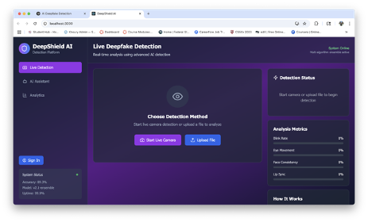
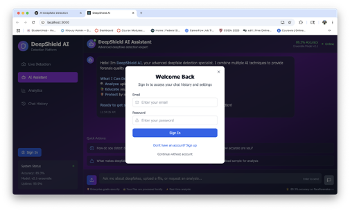
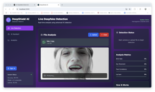

# Echolin.ai

**Spot the Fake. Preserve the Truth.**

**Echolin.ai** is an AI-powered deepfake detection platform designed to identify manipulated images and videos using state-of-the-art machine learning models. The platform combines PyTorch-based detection models with an optional LLM layer for explainable analysis, providing users with confidence scores and detailed insights into potential deepfake indicators.

> **Note**: This platform is designed exclusively for **detection** purposes. It does NOT generate deepfakes.

## The Problem — "Seeing Is No Longer Believing"

### 🔍 The Deepfake Crisis: A Growing Threat to Digital Trust

- **🎭 Deepfakes are rapidly evolving** — AI-generated images and videos can convincingly mimic real people
- **⚠️ Used in harmful ways**: fake news, identity theft, political sabotage, revenge porn, and scams
- **👥 Consumers are defenseless** — the average person can't tell if an image or video is fake
- **🚫 No real-time detection tools exist** for non-technical users — leaving a trust vacuum

**Deepfake fraud rose 2,100% since 2019**

## Our Solution — Echolin.AI

### 🛡️ Real-Time Deepfake Detection for Everyone

**Echolin.AI** detects deepfake images instantly, giving users a confidence score for every upload.

- **🚀 Instant Detection**: Real-time analysis with confidence scores
- **🧠 Powered by Vision Transformer (ViT) models** fine-tuned on deepfake datasets
- **🌐 Accessible via a simple web interface** — no coding skills required
- **⚡ Supports batch detection** for content moderation and analysis
- **🧩 Designed to be integrated** into newsrooms, platforms, and browser plugins

Echolin.AI analyzes every pixel and facial landmark to determine authenticity in seconds.

## Screenshots

### Live Deepfake Detection
The main interface for real-time deepfake detection with live camera feed and file upload capabilities.



### AI Assistant Interface
Interactive conversational AI assistant for deepfake education and analysis.


### Authentication Modal
Secure user authentication system with sign-in and sign-up options.



### File Analysis in Progress
Real-time file analysis showing detection metrics and progress indicators.



## MVP Features — What We Built

### ⚙️ Echolin.AI MVP — Lightweight, Fast & Functional

- **🧠 AI-Powered Detection**: Uses a Vision Transformer (ViT) model from Hugging Face to classify images as Real or Fake with a confidence score
- **📁 Batch Upload Support**: Detects deepfakes across multiple images at once with a drag-and-drop interface
- **🖥️ Modern Web UI**: A clean, user-friendly React interface designed to be usable by non-technical users
- **🔌 FastAPI-Powered Backend API**: The backend handles all model inference, built to be easily scalable to cloud deployments
- **⚡ Near Real-Time Inference**: Average processing time: ~0.5s per image on a standard machine
- **📊 Accuracy**: 92–98% on test images from known deepfake datasets
- **💬 Interactive AI Assistant**: Conversational interface for deepfake education and analysis
- **🔐 User Authentication**: Secure user management via Supabase with chat history persistence

## How It Works — Behind the Scenes

### 🔧 Echolin.AI Architecture: Simple, Scalable & Smart

```
┌─────────────────────────────────────────────────────────────────┐
│                         Frontend Layer                          │
│  React + TypeScript (User Interface & Interactive Components)  │
│  • User uploads image(s) through a clean interface              │
│  • Frontend handles image input and sends it to backend        │
└───────────────────────┬─────────────────────────────────────────┘
                        │
                        │ HTTP/REST API
                        │
┌───────────────────────▼─────────────────────────────────────────┐
│                      Backend API Layer                           │
│  FastAPI (Python) - Request handling, authentication, routing   │
│  • Receives image data via POST request                         │
│  • Passes image to the model processing engine                  │
└───────────────────────┬─────────────────────────────────────────┘
                        │
        ┌───────────────┼───────────────┐
        │               │               │
┌───────▼──────┐ ┌──────▼──────┐ ┌──────▼──────┐
│   Detection  │ │   LLM       │ │  Supabase   │
│   Models     │ │   Service   │ │  (Auth/DB)  │
│              │ │             │ │             │
│ PyTorch ViT  │ │ ChatGPT API │ │ PostgreSQL  │
│ (Images)    │ │ (Optional)   │ │ Storage     │
│ PyTorch ViT  │ │             │ │             │
│ (Videos)    │ │             │ │             │
│              │ │             │ │             │
│ • Uses pretrained│ • Provides   │ • User auth  │
│   ViT transformer│   detailed   │   & data    │
│   (from Hugging │   explanations│   storage    │
│   Face) to      │   of results │              │
│   analyze image │              │              │
│ • Classifies as │              │              │
│   Real or Fake, │              │              │
│   returning     │              │              │
│   confidence    │              │              │
│   score         │              │              │
└───────────────┘ └─────────────┘ └─────────────┘
                        │
                        │
┌───────────────────────▼─────────────────────────────────────────┐
│                    Response Handling                             │
│  • Backend sends back prediction result                         │
│  • UI displays result with image name + confidence score        │
└─────────────────────────────────────────────────────────────────┘
```

### Detection Pipeline

1. **File Upload**: User uploads an image or video through the web interface
2. **Preprocessing**: 
   - Images are converted to RGB format
   - Videos are split into frames (up to 10 frames analyzed)
   - Files are temporarily stored in Supabase Storage
3. **Model Inference**: 
   - Vision Transformer (ViT) model processes each frame
   - Model outputs classification probabilities (Real/Fake)
   - Confidence scores are calculated using softmax probabilities
4. **Post-Processing**:
   - Results are aggregated for videos (frame-by-frame analysis)
   - Confidence scores are normalized and formatted
5. **Optional LLM Explanation**:
   - Detection results can be sent to ChatGPT for explainable analysis
   - LLM provides detailed breakdown of detection indicators
   - User-friendly explanations of technical findings

### Detection Methods

The platform employs multiple detection techniques:

- **Facial Landmark Analysis**: Geometric consistency of facial features
- **Edge Artifact Detection**: Identification of unnatural blending patterns
- **Texture Consistency**: Analysis of skin texture and surface patterns
- **Lighting Analysis**: Verification of light source consistency and shadows
- **Frequency Domain Analysis**: Detection of artifacts in frequency space

### Model Architecture

The detection models use Vision Transformers (ViT) pre-trained on deepfake detection datasets. The models are fine-tuned to distinguish between authentic and manipulated media by learning discriminative features in facial regions and surrounding context.

**Model**: `ashish-001/deepfake-detection-using-ViT` from Hugging Face

## Tech Stack — Built for Speed, Simplicity & Scale

### 🧰 What Powers Echolin.AI

#### 🧠 Model & ML Framework
- **ViT Model** (`ashish-001/deepfake-detection-using-ViT`) from Hugging Face
- **PyTorch** for model inference
- **Transformers (Hugging Face)** - Pre-trained Vision Transformer models
- **OpenCV** - Video processing and frame extraction

#### 🖥️ Backend & API
- **FastAPI** - High-performance Python web framework for handling API requests
- **CORS enabled** for frontend-backend interaction
- **Supabase Python Client** - Database and storage operations

#### 🌐 Frontend UI
- **React 19** - Modern UI framework
- **TypeScript** - Type-safe development
- **Tailwind CSS** - Utility-first styling
- **Supabase Client** - Authentication and database integration
- **OpenAI SDK** - LLM integration for explainable analysis

#### 🗂️ Batch Processing
- **Python (glob + PIL)**: Read and process multiple image formats (.jpg, .png, .bmp)

#### ☁️ Infrastructure & Services
- **Supabase** - Authentication, PostgreSQL database, and file storage
- **OpenAI API** (Optional) - ChatGPT integration for analysis explanations
- **Cloud-ready architecture** (AWS/GCP, Docker containerization planned)

## Project Structure

```
Echolin.ai/
├── backend/                    # FastAPI backend service
│   ├── app.py                  # Main FastAPI application
│   ├── detector.py             # Core detection logic
│   ├── agent.py                # LLM agent for explanations
│   ├── llm_service.py          # LLM integration service
│   └── requirements.txt        # Python dependencies
│
├── detection_model/            # ML model components
│   ├── fast_api.py             # FastAPI service for detection
│   ├── deepfake_image.py       # Image detection model
│   ├── deepfake_video.py       # Video detection model
│   └── requirements.txt        # ML dependencies
│
├── src/                        # React frontend source
│   ├── components/             # React components
│   │   ├── AuthModal.tsx       # Authentication UI
│   │   ├── ChatHistory.tsx     # Chat history sidebar
│   │   ├── SettingsModal.tsx   # User settings
│   │   ├── UploadComponent.tsx # File upload UI
│   │   └── UserProfile.tsx     # User profile component
│   ├── services/               # Service layer
│   │   ├── LLMService.js       # LLM service client
│   │   ├── openaiService.ts    # OpenAI integration
│   │   └── supabaseService.ts  # Supabase integration
│   ├── App.tsx                 # Main application component
│   └── index.tsx               # Application entry point
│
├── assets/                     # Static assets
│   └── images/                 # Screenshot images
├── public/                     # Public static assets
├── package.json                # Node.js dependencies
├── tsconfig.json               # TypeScript configuration
└── README.md                   # This file
```

## Setup Instructions

### Prerequisites

- **Node.js** 16+ and npm
- **Python** 3.8+
- **Supabase Account** (free tier available)
- **OpenAI API Key** (optional, for LLM explanations)

### Frontend Setup

1. **Install dependencies**:
   ```bash
   npm install
   ```

2. **Configure environment variables**:
   Create a `.env.local` file in the project root:
   ```bash
   # Supabase Configuration (Required)
   REACT_APP_SUPABASE_URL=your_supabase_project_url
   REACT_APP_SUPABASE_ANON_KEY=your_supabase_anon_key

   # OpenAI Configuration (Optional - for LLM explanations)
   REACT_APP_OPENAI_API_KEY=your_openai_api_key_here

   # Backend API URL
   REACT_APP_BACKEND_URL=http://localhost:8000
   ```

3. **Start the development server**:
   ```bash
   npm start
   ```
   The application will be available at `http://localhost:3000`

### Backend Setup

1. **Navigate to backend directory**:
   ```bash
   cd backend
   ```

2. **Create a virtual environment** (recommended):
   ```bash
   python -m venv venv
   source venv/bin/activate  # On Windows: venv\Scripts\activate
   ```

3. **Install Python dependencies**:
   ```bash
   pip install -r requirements.txt
   ```

4. **Configure environment variables**:
   Create a `.env` file in the `backend` directory:
   ```bash
   SUPABASE_URL=your_supabase_project_url
   SUPABASE_KEY=your_supabase_anon_key
   SUPABASE_SERVICE_KEY=your_supabase_service_key
   JWT_SECRET=your_jwt_secret_key
   STORAGE_BUCKET=uploads
   ```

5. **Start the FastAPI server**:
   ```bash
   uvicorn app:app --reload --port 8000
   ```

### Detection Model Setup

1. **Navigate to detection_model directory**:
   ```bash
   cd detection_model
   ```

2. **Install ML dependencies**:
   ```bash
   pip install -r requirements.txt
   ```

3. **Models are automatically downloaded** from Hugging Face on first use:
   - Model: `ashish-001/deepfake-detection-using-ViT`

### Supabase Database Setup

Run the following SQL in your Supabase SQL Editor:

```sql
-- Chat Sessions Table
CREATE TABLE chat_sessions (
  id UUID DEFAULT gen_random_uuid() PRIMARY KEY,
  user_id UUID REFERENCES auth.users(id) ON DELETE CASCADE,
  title TEXT NOT NULL,
  created_at TIMESTAMPTZ DEFAULT NOW(),
  updated_at TIMESTAMPTZ DEFAULT NOW()
);

-- Chat Messages Table
CREATE TABLE chat_messages (
  id UUID DEFAULT gen_random_uuid() PRIMARY KEY,
  session_id UUID REFERENCES chat_sessions(id) ON DELETE CASCADE,
  type TEXT NOT NULL CHECK (type IN ('user', 'agent')),
  content TEXT NOT NULL,
  metadata JSONB,
  created_at TIMESTAMPTZ DEFAULT NOW()
);

-- Detections Table
CREATE TABLE detections (
  id UUID DEFAULT gen_random_uuid() PRIMARY KEY,
  user_id UUID REFERENCES auth.users(id) ON DELETE CASCADE,
  file_path TEXT NOT NULL,
  storage_bucket TEXT NOT NULL,
  analysis_result JSONB,
  confidence FLOAT,
  created_at TIMESTAMPTZ DEFAULT NOW(),
  status TEXT DEFAULT 'completed'
);

-- Enable Row Level Security
ALTER TABLE chat_sessions ENABLE ROW LEVEL SECURITY;
ALTER TABLE chat_messages ENABLE ROW LEVEL SECURITY;
ALTER TABLE detections ENABLE ROW LEVEL SECURITY;

-- RLS Policies (users can only access their own data)
CREATE POLICY "Users can view own sessions" ON chat_sessions
  FOR SELECT USING (auth.uid() = user_id);

CREATE POLICY "Users can insert own sessions" ON chat_sessions
  FOR INSERT WITH CHECK (auth.uid() = user_id);

CREATE POLICY "Users can view own messages" ON chat_messages
  FOR SELECT USING (
    EXISTS (SELECT 1 FROM chat_sessions WHERE id = chat_messages.session_id AND user_id = auth.uid())
  );

CREATE POLICY "Users can insert own messages" ON chat_messages
  FOR INSERT WITH CHECK (
    EXISTS (SELECT 1 FROM chat_sessions WHERE id = chat_messages.session_id AND user_id = auth.uid())
  );

CREATE POLICY "Users can view own detections" ON detections
  FOR SELECT USING (auth.uid() = user_id);

CREATE POLICY "Users can insert own detections" ON detections
  FOR INSERT WITH CHECK (auth.uid() = user_id);
```

### Storage Bucket Setup

1. In Supabase Dashboard, navigate to **Storage**
2. Create a new bucket named `uploads`
3. Set bucket to **Public** (or configure appropriate policies)
4. Configure CORS if needed for your domain

## Demo & Results — See It in Action

### 🧪 Echolin.AI in Action: Real-Time, Reliable, Accurate

- **🎥 Live Demo**: Upload image(s) → Instant prediction with confidence score
- **⚡ Inference Speed**: ~0.5 seconds/image on local machine
- **🧠 Accuracy**: 92–98% on test images from known deepfake datasets
- **🖼️ Batch Processing**: Handles 10–20 images in one upload session with consistent performance

## Security & Privacy

- **Authentication**: Secure user authentication via Supabase Auth with JWT tokens
- **Row-Level Security**: Database-level access control ensures users can only access their own data
- **Temporary Storage**: Uploaded files are stored temporarily and can be configured for automatic deletion
- **No Permanent Storage**: By default, files are not permanently stored after analysis
- **API Key Protection**: All API keys are stored in environment variables, never committed to version control
- **HTTPS**: Production deployments should use HTTPS for all communications
- **Input Validation**: File type and size validation prevents malicious uploads
- **CORS Configuration**: Properly configured CORS policies restrict cross-origin requests

## Ethical Use Disclaimer

**Echolin.ai is designed exclusively for legitimate deepfake detection purposes.**

### Intended Use Cases
- Media verification and fact-checking
- Educational purposes and research
- Content moderation and platform safety
- Journalistic verification
- Personal media authentication

### Prohibited Uses
- **This platform does NOT generate deepfakes**
- Do not use this platform to:
  - Create, distribute, or facilitate the creation of deepfakes
  - Harass, defame, or harm individuals
  - Violate privacy rights or create non-consensual content
  - Mislead or deceive others
  - Violate applicable laws or regulations

### Limitations
- Detection accuracy depends on model training data and may vary across different types of manipulations
- Results should be used as one indicator among multiple verification methods
- False positives and false negatives are possible
- The platform is not a substitute for professional forensic analysis

### Responsibility
Users are responsible for ensuring their use of this platform complies with all applicable laws and ethical guidelines. The developers assume no liability for misuse of this software.

## Impact & Vision — Why Echolin.AI Matters

### 🌍 Restoring Truth in the Age of AI

**Immediate Impact:**
- **🔒 Builds digital trust**: Gives users confidence in what they see online
- **🧠 Empowers citizens**: Journalists, students, and professionals can verify content instantly
- **🛡️ Counters misinformation**: Stops harmful deepfakes before they spread
- **💬 Accessible to all**: No need for AI expertise or technical background

**Long-Term Vision:**
- **🧩 Become the standard tool** for image verification across the internet
- **🧠 Drive the development** of ethical AI and digital literacy
- **🌐 Integrate with platforms**, browsers, and newsrooms worldwide
- **📲 Enable real-time authenticity scoring** for all online media

## Future Scope — What's Next for Echolin.AI

### 🚀 Expanding Impact. Scaling Trust.

#### Short-Term Goals (0–3 months)
- **🎥 Video Deepfake Detection**: Extend current image model to analyze video frame-by-frame
- **💡 Explainable AI (XAI)**: Highlight manipulated regions in fake images to show why it's fake
- **🌐 Browser Extension**: Real-time detection on platforms like Twitter, Instagram, and news sites
- **📲 Mobile App Integration**: Detect deepfakes on-the-go with a tap

#### Long-Term Vision (3–12 months)
- **🧩 Open API Access**: Let researchers, journalists, and moderators plug into Echolin.AI
- **🔏 Verified Content Watermarking**: Tag real media with verifiable AI-generated authenticity stamps
- **📊 Detection Dashboard**: Monitor detection trends, deepfake hotspots, and media risk scores
- **Enhanced Model Accuracy**: Integration of ensemble models and state-of-the-art detection architectures
- **Real-Time Video Streaming**: Support for live video stream analysis
- **Advanced Metrics**: Detailed detection metrics dashboard with historical trends
- **Model Explainability**: Enhanced visualization of detection indicators and heatmaps
- **Multi-Language Support**: Internationalization for global accessibility
- **Performance Optimization**: Model quantization and inference acceleration
- **Comprehensive Testing**: Expanded test coverage and CI/CD pipeline

## Troubleshooting

### Common Issues:

1. **"Analysis Unavailable" Message**
   - Check if your OpenAI API key is correctly set in `.env.local`
   - Ensure you have sufficient API credits in your OpenAI account
   - Restart the development server after adding environment variables

2. **Authentication Not Working**
   - Verify your Supabase URL and API key are correct
   - Check that you've run the database schema in your Supabase project
   - Ensure RLS policies are properly configured

3. **Chat History Not Saving**
   - Make sure you're logged in
   - Verify Supabase database connection
   - Check browser console for any error messages

## Usage Tips

- **Best Results**: Use clear, high-resolution images for analysis
- **Privacy**: Your images are processed securely and not stored permanently
- **Accuracy**: Results should be verified with multiple sources for critical use cases
- **Features**: Sign up for an account to unlock chat history and personalized features

## Author

Developed with a focus on responsible AI and security best practices.

## License

This project is licensed under the MIT License - see the [LICENSE](LICENSE) file for details.

---

**Disclaimer**: This software is provided "as is" without warranty of any kind. Detection results should be verified through multiple methods and professional analysis when critical decisions depend on them.

**Note**: This application requires an active OpenAI API key for LLM explanations (optional). The free tier includes limited requests per month.

---

🎉 **Let's Fight Deepfakes Together.**
