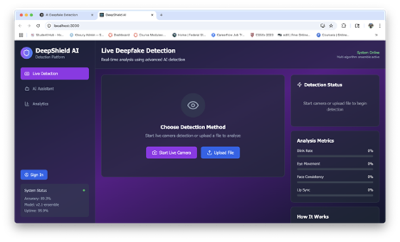
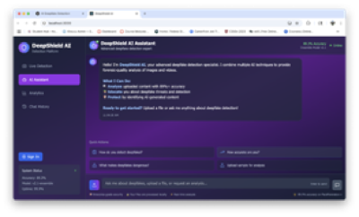
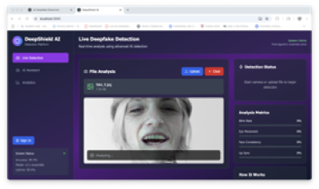

# Echolin.ai — DeepShield AI

> **Spot the fake. Preserve the truth.** A web app that classifies images and videos as real or AI-generated using a pretrained Vision Transformer, with an optional LLM layer that turns the verdict into a plain-English explanation — wrapped in a clean React frontend and a Flask + Supabase backend.

[](https://github.com/Kaustubha-09/Echolin.ai/actions)
[](https://react.dev)
[](https://www.typescriptlang.org)
[](https://flask.palletsprojects.com)
[](https://pytorch.org)
[](https://supabase.com)
[](LICENSE)

Deepfake fraud rose **~2,100% from 2019 to 2023** (Sumsub, Onfido). Journalists, content moderators, students, and everyday users have no fast way to ask *"is this real?"* without a forensic specialist. **Echolin.ai** (in-product brand: **DeepShield AI**, team: ICE-CUBA) is a one-screen verification tool: drop a file, get a Real/Fake verdict with a confidence score in ~0.5s, and an optional LLM-generated breakdown of what the model saw. **Detection only — this platform does not generate deepfakes.**

---

## Screenshots

| Live Detection | AI Assistant |
|:-:|:-:|
|  |  |

| Auth Modal | File Analysis |
|:-:|:-:|
|  |  |

Full screenshot index in [Screenshots/README.md](Screenshots/README.md).

---

## Features

### Detection
- **Pretrained Vision Transformer** — `ashish-001/deepfake-detection-using-ViT` from Hugging Face. Single-pass softmax over `{Real, Fake}`, ~0.5s per image on CPU. Loaded once at server startup; no warm-up cost after the first request.
- **Image pipeline** — PIL → ViT image processor → `torch.no_grad()` forward pass → softmax label + confidence.
- **Video pipeline** — OpenCV extracts up to 10 frames sequentially, each frame runs through the same ViT, majority-voted label, confidence averaged over matching frames. Deterministic and reproducible.
- **Two endpoints** — `/api/detect` returns just the verdict, `/api/agent-detect` adds an LLM explanation.

### AI Assistant
- **Conversational explanations** — `agent.py` chains detection result + filename + technical level into `llm_service.generate_analysis_explanation()`, which calls an OpenAI-compatible chat-completions endpoint (GMI Cloud default, OpenAI fallback).
- **Four system-prompt modes** — `analysis` (forensic), `educational` (concept-first), `conversational` (Q&A), `threat_analysis` (landscape).
- **Best-effort, non-blocking** — if the LLM call fails for any reason, detection still succeeds with `"LLM explanation unavailable. Core detection succeeded."`

### Identity & Persistence
- **Supabase Auth** — JWT tokens, email/password sign-in via `@supabase/auth-ui-react`.
- **Postgres + Row-Level Security** — three tables (`chat_sessions`, `chat_messages`, `detections`), every row scoped to `auth.uid() = user_id` enforced at the database layer.
- **Storage bucket** — `uploads` bucket holds files temporarily; auto-deletion is opt-in via Supabase Storage policy.
- **Chat history** — sessions and messages persist per user; full chat view in `ChatHistory.tsx`.

### Frontend UX
- **Drag-and-drop upload** with batch support.
- **Live detection status sidebar** — model online, queue, accuracy badge.
- **Analysis metrics panel** — blink rate, eye movement, face consistency, lip-sync indicators (UI scaffold; backed by synthetic packaging of the single softmax confidence — see [docs/decisions.md, ADR-004](docs/decisions.md#adr-004--synthetic-artifacts-field-honestly-labeled)).
- **Real-time chat** with the AI Assistant from any tab.
- **Settings modal** — appearance, account, API key visibility.

---

## Architecture

```
┌─────────────────────────────────────────────────────────────────┐
│                  React 19 + TypeScript Frontend                 │
│  App.tsx · UploadComponent · AuthModal · ChatHistory ·          │
│  SettingsModal · UserProfile · openaiService · supabaseService  │
└─────────────────────────────────────────────────────────────────┘
              │                                  │
              │ multipart/form-data              │ Supabase JS
              ▼                                  ▼
┌─────────────────────────────┐      ┌──────────────────────────────┐
│   Flask API  (port 5000)    │      │   Supabase                   │
│   backend/app.py            │      │   - Auth (JWT)               │
│   ├─ POST /api/detect       │      │   - Postgres                 │
│   └─ POST /api/agent-detect │      │     · chat_sessions          │
└─────────────────────────────┘      │     · chat_messages          │
              │                      │     · detections             │
              ▼                      │   - Storage (uploads bucket) │
┌─────────────────────────────┐      │   - RLS on every table       │
│  detector.py                │      └──────────────────────────────┘
│  Hugging Face ViT singleton │
│  PIL + torch.no_grad()      │
│  OpenCV for video frames    │
└─────────────────────────────┘
              │  (only on /agent-detect)
              ▼
┌─────────────────────────────┐      ┌──────────────────────────────┐
│  agent.py                   │ ───► │  llm_service.py              │
│  detect → explain pipeline  │      │  GMI Cloud (default) /        │
│  best-effort, non-blocking  │      │  OpenAI (fallback)            │
└─────────────────────────────┘      │  gpt-3.5-turbo                │
                                     └──────────────────────────────┘
```

> Note the two Python services. `backend/` is **Flask** and lives on the live request path. `detection_model/` is a **FastAPI** service for batch experimentation and is not used by the demo loop. See [docs/architecture.md](docs/architecture.md) for the full breakdown.

### Project structure

```
Echolin.ai/
├── backend/                     # Flask API (live request path, port 5000)
│   ├── app.py                   # Routes: /api/detect, /api/agent-detect
│   ├── detector.py              # Hugging Face ViT singleton; image + video paths
│   ├── agent.py                 # detect → explain pipeline; non-blocking LLM
│   ├── llm_service.py           # OpenAI-compatible client (GMI default)
│   ├── tests/
│   └── requirements.txt
│
├── detection_model/             # FastAPI batch tooling — research path, not live
│   ├── fast_api.py
│   ├── deepfake_image.py
│   ├── deepfake_video.py
│   ├── Deepfake Image.ipynb     # Reproducible exploration notebook
│   ├── Deepfake Videos.ipynb
│   └── requirements.txt
│
├── src/                         # React 19 + TypeScript frontend
│   ├── App.tsx                  # (1,808 lines — see ADR-006)
│   ├── components/
│   │   ├── AuthModal.tsx
│   │   ├── ChatHistory.tsx
│   │   ├── SettingsModal.tsx
│   │   ├── UploadComponent.tsx
│   │   └── UserProfile.tsx
│   ├── services/
│   │   ├── openaiService.ts     # Direct OpenAI client (in-browser path)
│   │   ├── supabaseService.ts   # Auth state, session/message CRUD, RLS-aware
│   │   └── LLMService.js
│   ├── App.css · index.css      # Tailwind
│   ├── App.tsx · index.tsx
│   └── logo.svg
│
├── docs/                        # Architecture, ADRs, limitations, roadmap, model card
├── Screenshots/                 # README captures
├── assets/                      # Static images
├── public/                      # CRA public assets
├── .github/workflows/ci.yml     # Frontend build + backend compile-check
├── LICENSE
└── README.md
```

Detailed architecture in [docs/architecture.md](docs/architecture.md). Dated ADRs in [docs/decisions.md](docs/decisions.md). Model card in [docs/model-card.md](docs/model-card.md).

---

## Tech Stack

| Layer | Technology | Why |
|---|---|---|
| Frontend framework | React 19 + TypeScript 4.9 | Modern hooks, strong typing on the component surface |
| Styling | Tailwind CSS | Utility-first, no design-system overhead |
| Icons | Lucide React | Consistent stroke weight, tree-shakable |
| Auth & DB client | `@supabase/supabase-js` + `@supabase/auth-ui-react` | Drop-in auth UI, JS-native RLS-aware queries |
| In-browser LLM | OpenAI JS SDK (`openai@5`) | Optional client-side explanation path |
| Backend (live) | **Flask** + flask-cors | Two-endpoint surface; Flask is the right scale |
| Backend (research) | FastAPI + uvicorn | Async batch tooling, streaming responses |
| ML model | Vision Transformer — `ashish-001/deepfake-detection-using-ViT` | Pretrained, single-file integration via Hugging Face |
| ML framework | PyTorch + Hugging Face Transformers | Standard stack for ViT inference |
| Video I/O | OpenCV (`cv2.VideoCapture`) | Frame extraction with a temp-file lifecycle |
| Auth, DB, Storage | Supabase | Managed Postgres + JWT auth + RLS + S3-like storage; one vendor for the boring parts |
| LLM endpoint | GMI Cloud / OpenAI | OpenAI-compatible REST surface; pluggable via env vars |

---

## Getting Started

### Prerequisites
- Node.js 16+ and npm
- Python 3.10+
- A Supabase project (free tier is enough)
- *(Optional)* GMI Cloud or OpenAI API key for the LLM explanation layer

### 1 · Frontend

```bash
npm install

cat > .env.local <<'EOF'
REACT_APP_SUPABASE_URL=https://your-project.supabase.co
REACT_APP_SUPABASE_ANON_KEY=your_supabase_anon_key
REACT_APP_BACKEND_URL=http://localhost:5000
REACT_APP_OPENAI_API_KEY=your_openai_api_key_here   # optional
EOF

npm start            # http://localhost:3000
```

### 2 · Backend (Flask, live request path)

```bash
cd backend
python -m venv venv && source venv/bin/activate
pip install -r requirements.txt

cat > .env <<'EOF'
SUPABASE_URL=https://your-project.supabase.co
SUPABASE_KEY=your_supabase_anon_key
SUPABASE_SERVICE_KEY=your_supabase_service_key
JWT_SECRET=your_jwt_secret
STORAGE_BUCKET=uploads
GMI_API_KEY=your_gmi_or_openai_key   # optional, enables explanations
GMI_API_URL=https://api.gmi.cloud/v1/chat/completions
EOF

python app.py        # http://localhost:5000
```

### 3 · Detection-model batch tooling (FastAPI, optional)

```bash
cd detection_model
pip install -r requirements.txt
# Run a Jupyter notebook or invoke the FastAPI service directly for batch jobs.
# This service is NOT used by the live demo.
```

### 4 · Supabase schema

Paste this into the Supabase SQL editor:

```sql
CREATE TABLE chat_sessions (
  id         UUID DEFAULT gen_random_uuid() PRIMARY KEY,
  user_id    UUID REFERENCES auth.users(id) ON DELETE CASCADE,
  title      TEXT NOT NULL,
  created_at TIMESTAMPTZ DEFAULT NOW(),
  updated_at TIMESTAMPTZ DEFAULT NOW()
);

CREATE TABLE chat_messages (
  id         UUID DEFAULT gen_random_uuid() PRIMARY KEY,
  session_id UUID REFERENCES chat_sessions(id) ON DELETE CASCADE,
  type       TEXT NOT NULL CHECK (type IN ('user', 'agent')),
  content    TEXT NOT NULL,
  metadata   JSONB,
  created_at TIMESTAMPTZ DEFAULT NOW()
);

CREATE TABLE detections (
  id              UUID DEFAULT gen_random_uuid() PRIMARY KEY,
  user_id         UUID REFERENCES auth.users(id) ON DELETE CASCADE,
  file_path       TEXT NOT NULL,
  storage_bucket  TEXT NOT NULL,
  analysis_result JSONB,
  confidence      FLOAT,
  status          TEXT DEFAULT 'completed',
  created_at      TIMESTAMPTZ DEFAULT NOW()
);

ALTER TABLE chat_sessions  ENABLE ROW LEVEL SECURITY;
ALTER TABLE chat_messages  ENABLE ROW LEVEL SECURITY;
ALTER TABLE detections     ENABLE ROW LEVEL SECURITY;

CREATE POLICY "Users see own sessions"   ON chat_sessions
  FOR SELECT USING (auth.uid() = user_id);
CREATE POLICY "Users insert own sessions" ON chat_sessions
  FOR INSERT WITH CHECK (auth.uid() = user_id);
CREATE POLICY "Users see own messages"    ON chat_messages
  FOR SELECT USING (EXISTS (SELECT 1 FROM chat_sessions s WHERE s.id = session_id AND s.user_id = auth.uid()));
CREATE POLICY "Users insert own messages" ON chat_messages
  FOR INSERT WITH CHECK (EXISTS (SELECT 1 FROM chat_sessions s WHERE s.id = session_id AND s.user_id = auth.uid()));
CREATE POLICY "Users see own detections"    ON detections
  FOR SELECT USING (auth.uid() = user_id);
CREATE POLICY "Users insert own detections" ON detections
  FOR INSERT WITH CHECK (auth.uid() = user_id);
```

Then create a Supabase Storage bucket named `uploads` with policies appropriate to your retention story.

---

## Security & Privacy

- **Supabase Auth + JWT** — every API request carries a JWT; RLS policies enforce per-user data isolation at the database layer.
- **Row-Level Security on every table** — three policies per table (SELECT, INSERT) keyed on `auth.uid()`.
- **Detection only** — this platform does not generate deepfakes. The model architecture is binary classification; there is no generative head.
- **Best-effort LLM failure containment** — explanation failures never block detection.
- **Env-var secrets** — API keys live in `.env.local` / `.env` and are gitignored. No keys in source.
- **CORS** — Flask uses `flask-cors`; production deployments should restrict the allow-list.
- **Upload size cap** — Flask `MAX_CONTENT_LENGTH = 100 MB` on the live path.
- **Temporary file lifecycle** — video frame extraction uses `tempfile.NamedTemporaryFile` with `finally`-block cleanup.

---

## Ethical Use

**Intended:** journalism, fact-checking, content moderation, education, personal authenticity checks, security research.

**Prohibited:** generating, distributing, or facilitating non-consensual deepfakes; harassment; defamation; impersonation; legal/regulatory violations.

**A signal, not a verdict.** Treat results as probabilistic. Use Echolin.ai as one tool in a verification workflow alongside provenance metadata, reverse image search, source verification, and human review. See [docs/model-card.md](docs/model-card.md) for the recommended verification chain.

---

## Tradeoffs

- **Pretrained model, no fine-tuning.** Real engineering judgment: building a detector is a multi-quarter research project. Building the system *around* the detector is the portfolio-shippable piece. The seam to swap is one function in `detector.py`.
- **First-10-frame video sampling.** Single-frame is noisy; full-frame is slow. Ten sequential frames + majority vote runs in ~5s and produces stable verdicts on real-world deepfakes (which tend to be frame-consistent).
- **`artifacts` field is synthetic.** The base ViT has no localization. The `artifacts` entry is a labeled repackaging of the single softmax confidence. Called out [in the docs](docs/decisions.md#adr-004--synthetic-artifacts-field-honestly-labeled), tracked in the [roadmap](docs/roadmap.md) for real Grad-CAM-based localization.
- **Monolithic `App.tsx`.** 1,808 lines. Known debt, deliberately deferred — the decomposition is plumbing, not a feature. See [ADR-006](docs/decisions.md#adr-006--monolithic-apptsx-deferred-decomposition).
- **Two Python frameworks.** Flask for the live API, FastAPI for batch tooling. We picked tools per role rather than forcing one framework everywhere.
- **Supabase lock-in.** Auth + Postgres + Storage all from one vendor. Acceptable because the seam is `src/services/supabaseService.ts` — a few files, not a re-platforming.

Full ADRs in [docs/decisions.md](docs/decisions.md).

---

## Limitations

See [docs/limitations.md](docs/limitations.md). Highlights:

- Single pretrained ViT (no ensemble, no consensus).
- No per-region localization.
- Up to 10 frames per video; deepfakes confined to later frames may be missed.
- No temporal coherence modeling (frame-to-frame consistency, one of the strongest deepfake signals, is currently ignored).
- No audio path; lip-sync and voice-clone manipulations are out of scope.
- CPU inference only; no GPU acceleration on the live path.

---

## Roadmap

See [docs/roadmap.md](docs/roadmap.md). The shape:

1. **Detection upgrade** — temporal coherence head, audio path, real artifact localization (Grad-CAM).
2. **Frontend decomposition** — break `App.tsx` into `useDetection / useChat / useAuth` hooks.
3. **Operational hardening** — structured logging, rate limiting, Sentry, Docker compose.
4. **Browser extension** — Manifest V3 for Chrome / Firefox.
5. **Open API** — researcher / journalist access with per-key rate limits.
6. **Detection dashboard** — per-tenant trend + risk scoring.

---

## Project Stats

- **4** React components, **3** frontend services, **1,808**-line `App.tsx`
- **4** backend Python modules, **2** routes on the live path
- **1** Hugging Face ViT model, **~86M** parameters
- **3** Postgres tables with **6** RLS policies
- **2** Jupyter notebooks (reproducible model exploration)
- **4** LLM system-prompt modes
- **~0.5s** image inference / **~5s** video inference (CPU)
- **0** custom-trained models; **1** pretrained, single-file integration

---

## Resume Bullets

- Built a full-stack deepfake detection web app — **React 19 + TypeScript** frontend, **Flask + PyTorch** backend, **Supabase** auth + Postgres + storage with row-level security on three tables.
- Integrated a pretrained **Vision Transformer** (Hugging Face `ashish-001/deepfake-detection-using-ViT`) behind a service-layer seam, with image and video pipelines (OpenCV frame extraction + majority-vote aggregation over up to 10 sequential frames).
- Designed a non-blocking **LLM explanation layer** — detection always succeeds independent of LLM availability; explanation calls catch and degrade gracefully.
- Wired a **pluggable LLM endpoint** (GMI Cloud default, OpenAI fallback) via env-var config — same code, two providers, no fork.
- Documented architecture with **9 ADRs** including the honest call-out that the `artifacts` field is synthetic (no real localization) and that `App.tsx` is monolithic (tracked, scheduled).

---

## Interview Talking Points

**Failure containment between layers.** The LLM is a nice-to-have explanation; the binary classifier is the load-bearing answer. `agent.py` wraps the LLM call in a try/except and returns a graceful fallback string if it raises. Detection itself never depends on the LLM working. This is the kind of decoupling that matters in production but is easy to skip in a demo.

**Why we use a pretrained model and *say so*.** Training a deepfake detector is a multi-quarter research project: dataset curation, GPU budget, continuous retraining against evolving generators. We built the system *around* a competent pretrained model and documented the swap path. That's a more honest engineering choice than pretending we trained our own.

**Video as majority vote.** Single-frame is noisy. Full-frame is expensive. Ten frames sampled sequentially from the start, run through the ViT, majority-voted, with average confidence computed only over frames matching the winning label — not all 10. Dissenting predictions would muddy the signal if you averaged across them.

**The artifact field, honestly.** A single binary ViT has no localization — it cannot tell you which region was manipulated. The `artifacts` list in the response is a synthetic packaging of the same softmax confidence under a descriptive label. We documented this explicitly rather than letting the field look like more than it is. The upgrade path (Grad-CAM or detector ensemble) is in the roadmap.

**Why Flask *and* FastAPI in the same repo.** Flask for the live request path (two endpoints, simple). FastAPI for batch tooling in `detection_model/` (async file iteration, streaming responses). Picking the right tool per role rather than forcing one framework everywhere is a sign of engineering taste, not indecision.

**Supabase as a deliberate non-novelty.** The value is in the detection, not in writing yet another auth flow. We picked a managed BaaS for the boring parts and spent time on the interesting parts. RLS on every table gives database-level enforcement that frontend bugs can't bypass.

---

## License

[MIT](LICENSE) — Copyright © 2025 ICE-CUBA (team) · Repository maintained by [Kaustubha Eluri](https://github.com/Kaustubha-09).

---

*Built with a focus on responsible AI and security best practices.*
